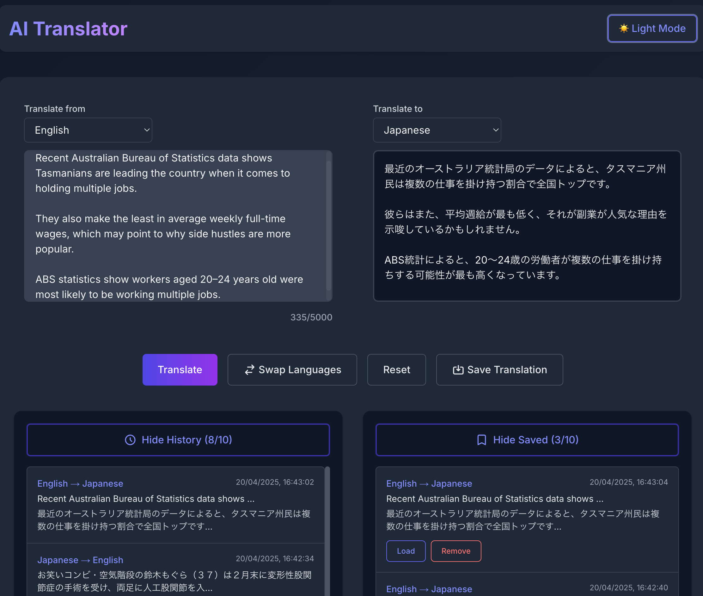

# AI Translator

A modern, user-friendly text-to-text translation application built with Next.js and powered by the Gemini AI API. This application offers a simple, intuitive interface for translating text between over 50 languages, with features for saving translations and viewing translation history.



## What It Does

AI Translator provides a seamless translation experience with the following features:

- **Text Translation**: Translate text between 50+ languages with high accuracy
- **Language Swap**: Easily switch between source and target languages
- **Translation History**: Access your last 10 translations
- **Saved Translations**: Save up to 10 favorite translations for future reference
- **Reset Functionality**: Clear text areas with a single click
- **Character Limit**: Support for up to 5000 characters per translation
- **Light/Dark Theme**: Choose your preferred visual mode
- **Responsive Design**: Works on desktop and mobile devices

## Tech Stack

This application is built using modern web technologies:

- **Frontend & Backend**: 
  - [Next.js](https://nextjs.org/) 14.x - React framework for server and client-side rendering
  - [React](https://reactjs.org/) 18.x - UI component library

- **Styling**:
  - [Tailwind CSS](https://tailwindcss.com/) 3.x - Utility-first CSS framework

- **APIs & Data Handling**:
  - [Gemini AI API](https://ai.google.dev/) - Google's generative AI model for translation
  - [Axios](https://axios-http.com/) - HTTP client for API requests
  - [js-cookie](https://github.com/js-cookie/js-cookie) - Client-side cookie handling

- **Development Tools**:
  - [TypeScript](https://www.typescriptlang.org/) - Type-safe JavaScript
  - [ESLint](https://eslint.org/) - Code quality tool
  - [PostCSS](https://postcss.org/) & [Autoprefixer](https://github.com/postcss/autoprefixer) - CSS processing

## Setup Instructions

### Prerequisites

- Node.js 18.x or higher
- npm or yarn
- A Gemini API key from the [Google AI Studio](https://makersuite.google.com/app/apikey)

### Local Development Setup

1. **Clone the repository**

   ```bash
   git clone https://github.com/yourusername/ai-translator.git
   cd ai-translator
   ```

2. **Install dependencies**

   ```bash
   npm install
   # or
   yarn install
   ```

3. **Set up environment variables**

   Create a `.env.local` file in the root directory:

   ```
   GEMINI_API_KEY=your_gemini_api_key
   ```

4. **Start the development server**

   ```bash
   npm run dev
   # or
   yarn dev
   ```

5. **Access the application**

   Open [http://localhost:3000](http://localhost:3000) in your browser.

### On-Premise Deployment

1. **Build the application**

   ```bash
   npm run build
   # or
   yarn build
   ```

2. **Start the production server**

   ```bash
   npm run start
   # or
   yarn start
   ```

3. **For production environments**

   - Configure your server to run the Next.js application
   - Set up environment variables securely on your server
   - Consider using a process manager like PM2 to keep the application running

   Example with PM2:
   ```bash
   npm install -g pm2
   pm2 start npm --name "ai-translator" -- start
   ```

### Deploying to Vercel

1. **Install Vercel CLI (optional)**

   ```bash
   npm install -g vercel
   # or
   yarn global add vercel
   ```

2. **Deploy to Vercel**

   The easiest way is to use the Vercel dashboard:

   - Push your code to a GitHub, GitLab, or Bitbucket repository
   - Import the project in the [Vercel dashboard](https://vercel.com/new)
   - Add your `GEMINI_API_KEY` in the Environment Variables section
   - Deploy

   Alternatively, use the CLI:

   ```bash
   vercel
   ```

3. **Set environment variables**

   - In the Vercel dashboard, navigate to your project
   - Go to Settings > Environment Variables
   - Add `GEMINI_API_KEY` with your API key value
   - Redeploy if necessary

## How to Use

### Basic Translation

1. Select your source language from the first dropdown menu
2. Enter text (up to 5000 characters) in the left text area
3. Select your target language from the second dropdown menu
4. Click the "Translate" button
5. View the translation in the right text area

### Additional Features

- **Swap Languages**: Click the "Swap" button to switch between source and target languages
- **Reset**: Click the "Reset" button to clear both text areas
- **Save Translation**: Click the "Save" button to add the current translation to your saved list
- **View History**: Access your last 10 translations in the history section
- **Load Saved/History Item**: Click on any item in the saved or history lists to reload it
- **Toggle Theme**: Switch between light and dark mode using the theme toggle button

## Security Considerations

- The Gemini API key is stored server-side and never exposed to the client
- All API calls are made through secure Next.js API routes
- Consider implementing additional security measures for production use:
  - IP restrictions in the Google Cloud Console
  - Regular API key rotation
  - Rate limiting to prevent abuse

## License

This project is licensed under the [MIT License](LICENSE.md) - see the [LICENSE.md](LICENSE.md) file for details.

## Contributing

Contributions are welcome! Please feel free to submit a Pull Request.

## Acknowledgements

- This project was built using the Gemini API from Google
- Thanks to the Next.js and React communities for their excellent documentation

## Links

- [Live Demo](https://ai-translator-self.vercel.app/)
- [GitHub Repository](https://github.com/vuhung16au/MachineLearning-GenAI/tree/main/AI-Translator)