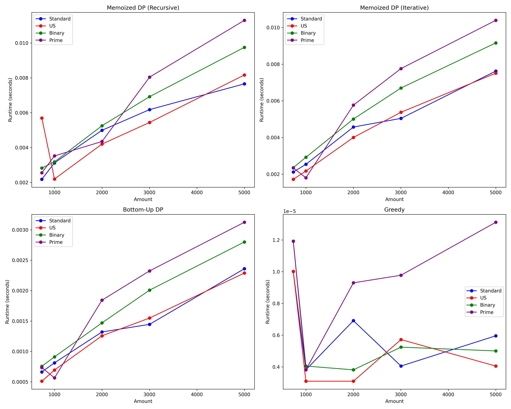

# Coin-Minimum

## Overview
An interactive analysis of the classic minimum coin change problem comparing various algorithmic approaches. This project demonstrates the performance differences between dynamic programming, greedy, and recursive solutions with visual runtime comparisons.

## Problem Statement
Given a set of coin denominations and a target amount, find the minimum number of coins needed to make up that amount. For example, with coins [1, 2, 5] and a target of 7, the optimal answer is 2 coins (5 + 2).

## Features
- Runtime comparisons across different coin sets (US, Standard, Prime, Binary)
- Implementation of multiple algorithms:
  - Naive recursive approach (too slow for large inputs)
  - Memoized recursive (Top-Down DP)
  - Bottom-Up Dynamic Programming
  - Greedy algorithm
- Visual explanations and complexity analysis
- Interactive charts showing performance metrics

## Usage
Open `index.html` in your browser to interact with the demonstration, view runtime comparisons, and explore algorithm implementations.

## Technologies Used
- HTML/CSS/JavaScript for the frontend interface
- Chart.js for data visualization
- MathJax for mathematical notation
- Mermaid for decision tree diagrams

## Project Structure
- `index.html`: Main interface with algorithm explanations and visualizations
- `js/charts.js`: Chart configurations for runtime comparisons
- `js/main.js`: Core functionality and event handlers
- `css/styles.css`: Styling for the interface

## Python Performance Analysis

The project includes a Python script `coin-minimum.py` that provides a comprehensive analysis of different coin change algorithms:

### Features
- Implements five different solution approaches:
  - Naive recursive (exponential complexity)
  - Memoized recursive (top-down dynamic programming)
  - Iterative memoization 
  - Bottom-up dynamic programming
  - Greedy algorithm (fast but not always optimal)
  
- Tests performance across four different coin sets:
  - Standard: [1, 2, 5, 10, 20, 50, 100]
  - US: [1, 5, 10, 25, 50, 100]
  - Binary: [1, 2, 4, 8, 16, 32, 64, 128]
  - Prime: [1, 2, 3, 5, 7, 11, 13, 17, 19]

### Running the Analysis
To run the performance analysis:

```bash
python coin-minimum.py
```

### Outputs
The script generates:

1. **Runtime CSV files** in the `./runtime/` directory:
   - `runtime_Standard.csv`
   - `runtime_US.csv`
   - `runtime_Binary.csv`
   - `runtime_Prime.csv`

2. **Performance visualizations**:
   - Individual graphs for each coin set showing algorithm performance
   - A combined visualization saved as `all_algorithms_comparison.png`



3. **Console output** showing the minimum number of coins needed for different amounts and the time taken by each algorithm.

## Links
- **GitHub Repository**: [Coin-Minimum on GitHub](https://github.com/vuhung16au/MachineLearning-GenAI/tree/main/Coin-Minimum)
- **Live Demo**: [Coin-Minimum on Vercel](https://coin-minimum.vercel.app/)

The visualizations highlight how algorithm performance varies with different coin denominations and target amounts, providing practical insights into the benefits of dynamic programming over naive approaches.
