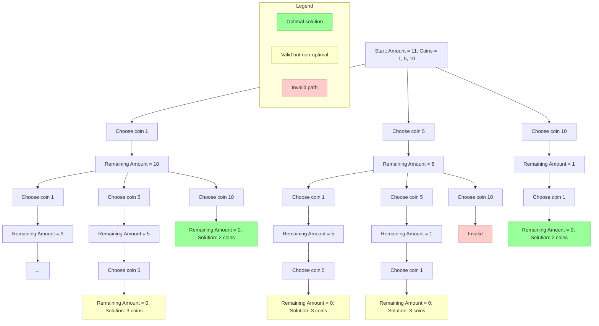

# Coin Minimum Problem - Decision Tree Visualization

The coin minimum problem aims to find the minimum number of coins needed to make a specific amount of money, given a set of coin denominations.

## Explanation:

1. We start with the amount 11 and available coins {1, 5, 10}
2. At each step, we choose one of the available coins
3. We continue until we reach the target amount (0 remaining)
4. The optimal solution is the path with the fewest coins
5. In this example, we have two optimal solutions with 2 coins:
   - Using a 10-cent coin followed by a 1-cent coin
   - Using a 1-cent coin followed by a 10-cent coin

Green nodes represent the optimal solutions, yellow nodes represent valid but non-optimal solutions, and red nodes represent invalid paths.
