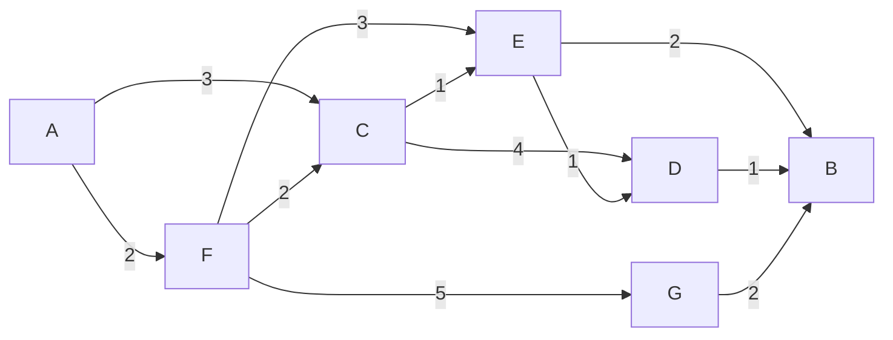
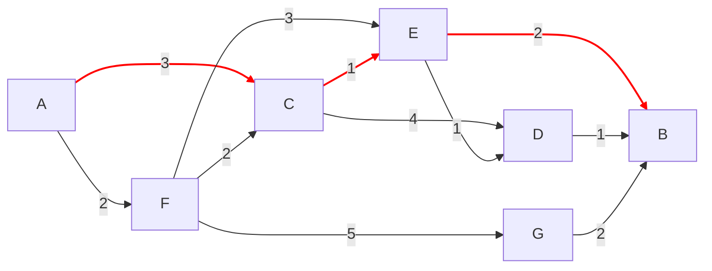

# Introduction 

This is a simple implementation of Dijkstra's algorithm in Python. The algorithm is used to find the shortest path in a directed graph with weighted edges.

You can find the code in the `Dijkstra.py` file and visualsation in the file `Djkstra-Animation.html` which can be run on browsers. The implementation is based on the algorithm described in Wikipedia: [Dijkstra's algorithm](https://en.wikipedia.org/wiki/Dijkstra%27s_algorithm).

# The problem

Find the shortest path in a directed graph with weighted edges from `A` to `B`.

# Introduce the Dijkstra algorithm

1. Initialization: Each location (town/vertex) is initially marked with an infinite travel time, except for the starting location, which is marked with zero . All locations are initially considered "unexplored".
2. Iteration: The algorithm repeatedly performs two main steps 
 - Choose Next Vertex: Select the unexplored location with the current shortest estimated travel time from the start. Mark this location as "explored".
 - Update Estimates: For the newly explored location, examine all directly connected neighboring locations. If traveling through the current location offers a shorter path to a neighbor than previously recorded, update that neighbor's shortest time estimate and record the current location as the preceding step on the path.
3. Completion: The process continues until the destination location is marked as explored.
4. Result: The final estimate recorded for the destination location is the shortest travel time from the start. By tracking the preceding locations recorded during the updates, the actual shortest path can be reconstructed.

# The code 

1. Runs in CLI: `Dijkstra.py`
2. Visualisation on browsers: `Dijkstra-Animation.html`

# The solution

