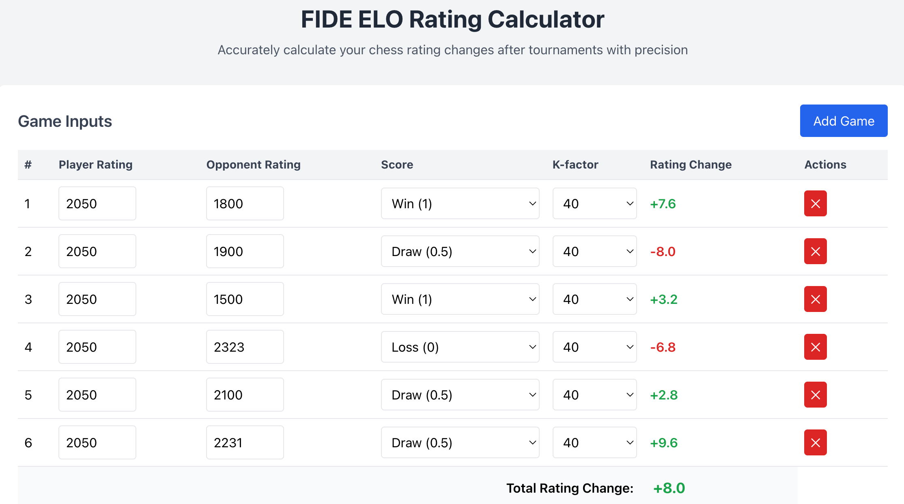

# FIDE ELO Calculator

A web-based application for calculating chess rating changes according to FIDE (International Chess Federation) regulations (as of 22 Apr 2025). This calculator allows players to input their ratings, opponent ratings, and game results to determine the expected rating changes after multiple games.



## Description

This application allows chess players to calculate their rating changes after tournaments or individual games with precision. It implements the official FIDE ELO formula and supports multiple K-factors based on FIDE guidelines.

## Live Demo

Try the live application here: [FIDE ELO Calculator](https://elo-calculator-bice.vercel.app/)

## Features

- Calculate rating changes for up to 20 games simultaneously
- Instantly view individual game rating changes and cumulative total
- Customize K-factors based on FIDE guidelines or your specific situation
- Save and load up to 30 different calculations for future reference
- Entirely client-side with no server dependencies
- Mobile-responsive design
- Local storage for saving calculations in your browser

## How to Run Tests with Cypress

This project uses Cypress for end-to-end testing. Follow these steps to run the tests:

1. **Install Dependencies**
   ```
   npm install
   ```

2. **Run Tests in Interactive Mode**

   ```
   npm start
   ```

   This will start a local server and open the application in your default browser. Then, in another terminal, run:

   ```
   npm test
   ```
   This will open the Cypress Test Runner where you can select individual tests to run.

3. **Run Tests Headlessly**
   ```
   npm run test:headless
   ```
   This will run all tests in the command line without opening a browser window.

4. **Run Tests with Server**
   ```
   npm run cy:run
   ```
   This will start the local development server and run the tests against it.

## Test Coverage

The test suite covers:
- Basic functionality of the calculator
- User interface interactions
- Data persistence features

## How to Use

1. **Enter Game Information**
   - Input your rating in the "Player Rating" field
   - Input your opponent's rating in the "Opponent Rating" field
   - Select your result (Win, Draw, or Loss)
   - Choose the appropriate K-factor

2. **Manage Multiple Games**
   - Click "Add Game" to add additional games (up to 20 total)
   - Use the "✕" button to remove specific games

3. **Save Your Calculations**
   - Enter a name for your calculation set
   - Click "Save Calculation" to store it locally in your browser

4. **Access Previous Calculations**
   - Select a saved calculation from the dropdown
   - Click "Load Calculation" to retrieve it
   - Use "Delete" to remove saved calculations

## K-factor Guidelines

According to FIDE regulations:

- **K = 40**: For new players (until 30 games) or players under 18 with rating < 2300
- **K = 20**: For players with rating < 2400
- **K = 10**: For players with rating ≥ 2400 (remains even if rating drops below 2400)

Additional rule: If the number of games (n) for a player on any list for a rating period multiplied by K exceeds 700, then K shall be the largest whole number such that K × n does not exceed 700.

## Technical Details

- **Frontend**: HTML, CSS (Tailwind), JavaScript
- **Framework**: AngularJS
- **Storage**: HTML5 Local Storage
- **Formula**:
  - Expected Score: E = 1 / (1 + 10^((Rc - R)/400))
  - Rating Change: ΔR = K × (W - E)
  - Where:
    - R: Player rating
    - Rc: Opponent rating
    - W: Score (1 for win, 0.5 for draw, 0 for loss)
    - K: K-factor (10-40)

## Installation and Usage

1. Clone this repository:
   ```
   git clone https://github.com/vuhung16au/MachineLearning-GenAI/tree/main/FIDE-ELO-Calculator.git
   ```

2. Open `index.html` in your web browser

No server configuration or installation is required as the application runs entirely in the browser.

Alternatively, you can use a local server like `http-server` or `live-server` to serve the files.

   ```
   http://localhost:8080
   ```
## Data Privacy

All calculations and saved data are stored locally in your browser using Local Storage. No information is sent to any server or external service.

## References

- [FIDE Rating Change Calculator](https://ratings.fide.com/calc.phtml?page=change)
- [FIDE Handbook, Chapter B.022024](https://handbook.fide.com/chapter/B022024)

## License

[MIT License](LICENSE.md)

## Acknowledgments

- International Chess Federation (FIDE) for establishing the rating system
- Tailwind CSS for the responsive design framework
- AngularJS for the interactive framework
