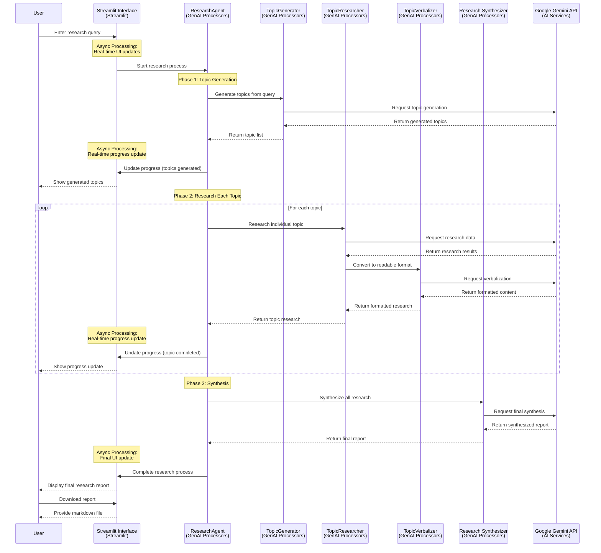
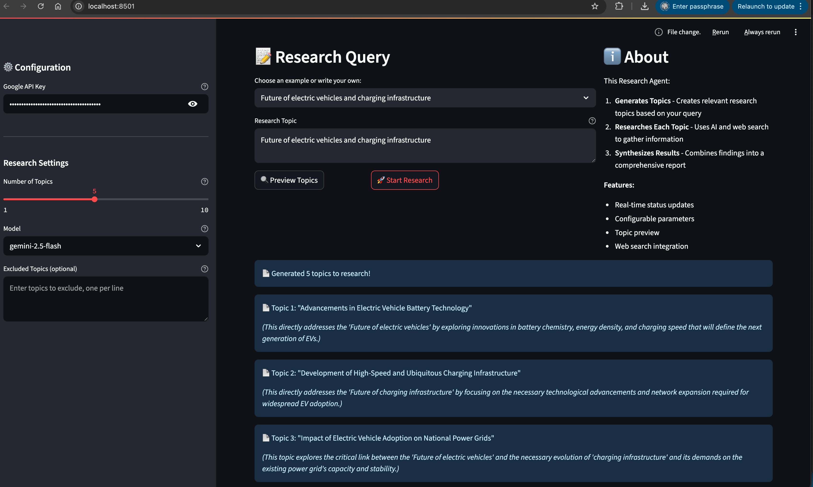

# Research Agent Streamlit App 🔬

A Streamlit web application that provides an interactive interface for the Research Agent from the GenAI Processors library. This app allows users to input research queries through a web interface and see the complete research process unfold in real-time.

## Features

- **Interactive Web Interface**: Easy-to-use web interface for research queries
- **Real-time Status Updates**: See the research process as it happens
- **Topic Preview**: Generate and preview research topics before starting full research
- **Configurable Parameters**: Adjust number of topics, AI models, and exclude specific topics
- **Research Synthesis**: Get a comprehensive research report combining all findings
- **Download Results**: Save your research report as a markdown file

## How It Works

The Research Agent breaks down complex research tasks into smaller, manageable components:

1. **Topic Generation**: Analyzes your query and generates relevant research topics
2. **Topic Research**: Uses AI and web search to gather information on each topic
3. **Research Synthesis**: Combines all findings into a comprehensive, well-structured report

## Installation

0. **Clone the Repository**:
   ```bash
   git clone git-clone-url
   cd genai-processor-playground/ResearchAgent
   ```

1. Setup a virtual environment (optional but recommended):
   ```bash
   python3 -m venv .venv
   source .venv/bin/activate  # On Windows use `.venv\Scripts\activate`
   ```

2. **Install Dependencies**:
   ```bash
   pip install -r requirements.txt
   ```

3. **Get Google API Key**:
   - Visit [Google AI Studio](https://aistudio.google.com/)
   - Create a new API key
   - Keep it secure for use in the application

## Usage

### Streamlit Web Interface

1. **Start the Application**:

   ```bash
   streamlit run streamlit_app.py
   ```

   Or use the launcher script:

   ```bash
   python run_app.py
   ```

2. **Configure Settings**:
   - Enter your Google API key in the sidebar
   - Adjust research parameters (number of topics, model, excluded topics)

3. **Enter Research Query**:
   - Choose from example prompts or write your own
   - Be specific about what you want to research

4. **Preview Topics** (Optional):
   - Click "Preview Topics" to see what topics will be researched
   - Review and adjust settings if needed

5. **Start Research**:
   - Click "Start Research" to begin the full research process
   - Watch real-time status updates as the agent works
   - Download your final research report

### Command Line Interface

For programmatic use or automation, you can also use the CLI version:

```bash
# Set your API key
export GOOGLE_API_KEY="your-api-key-here"
```

## Example Queries

- "Research the best things about Vietnam's military power!"
- "What are the latest developments in artificial intelligence?"
- "How can I start a vegetable garden in a small urban space?"
- "What are the environmental impacts of renewable energy?"
- "Best practices for remote team management"

## Configuration Options

### Research Settings
- **Number of Topics**: 1-10 topics (default: 5)
- **AI Model**: Choose from Gemini models (2.5-flash, 1.5-pro, 1.5-flash)
- **Excluded Topics**: Specify topics to avoid researching

### Advanced Features
- **Real-time Progress**: Visual progress bar and status updates
- **Process Log**: Complete history of research steps
- **Error Handling**: User-friendly error messages and recovery
- **Download Reports**: Save results in markdown format

## Technical Details

This application is built on top of the GenAI Processors library and uses:

- **Streamlit**: For the web interface
- **Google Gemini API**: For AI-powered research and synthesis
- **GenAI Processors**: For modular research pipeline components
- **Async Processing**: For real-time updates and responsive UI

### Architecture

The app consists of several key components:

1. **ResearchAgent**: Main orchestrator that coordinates the research pipeline
2. **TopicGenerator**: Generates relevant research topics from user queries
3. **TopicResearcher**: Conducts detailed research on each topic
4. **TopicVerbalizer**: Converts research data into human-readable format
5. **Research Synthesizer**: Combines all research into a final report

#### Research Flow Sequence Diagram

**Technology Stack Components:**
- **Streamlit Interface (S)**: Web interface for user interactions and real-time updates
- **GenAI Processors Components**: ResearchAgent (RA), TopicGenerator (TG), TopicResearcher (TR), TopicVerbalizer (TV), Research Synthesizer (RS) - modular research pipeline components
- **Google Gemini API (API)**: AI-powered research and synthesis for all AI operations
- **Async Processing**: Real-time progress updates between components for responsive UI



## Security Notes

- API keys are handled securely and not stored permanently
- All processing happens through secure Google AI APIs
- No user data is retained after the session ends


## License

This example is licensed under the MIT License. See the [LICENSE](LICENSE) file for details.

# Screenshots

## Streamlit App Interface


## CLI Interface

```
$ python cli_example.py
ℹ️  No query provided, using default: Research the best things about Vietnam's military power!
🔬 Research Agent CLI
Query: Research the best things about Vietnam's military power!
Topics: 5
==================================================
📋 Research Process:
  • Generated 5 topics to research!
  • Topic 1: "Analysis of Vietnam's historical military doctrines and their application in modern defense strategies."
...
```

## Live demo 

You can try the Research Agent app live at [Research Agent Demo](https://genai-research-agent.streamlit.app/).