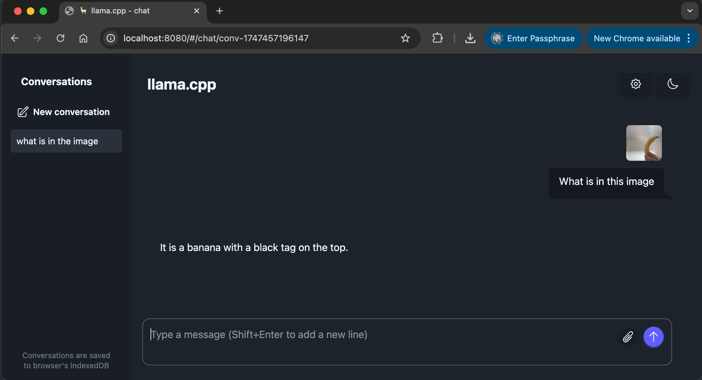
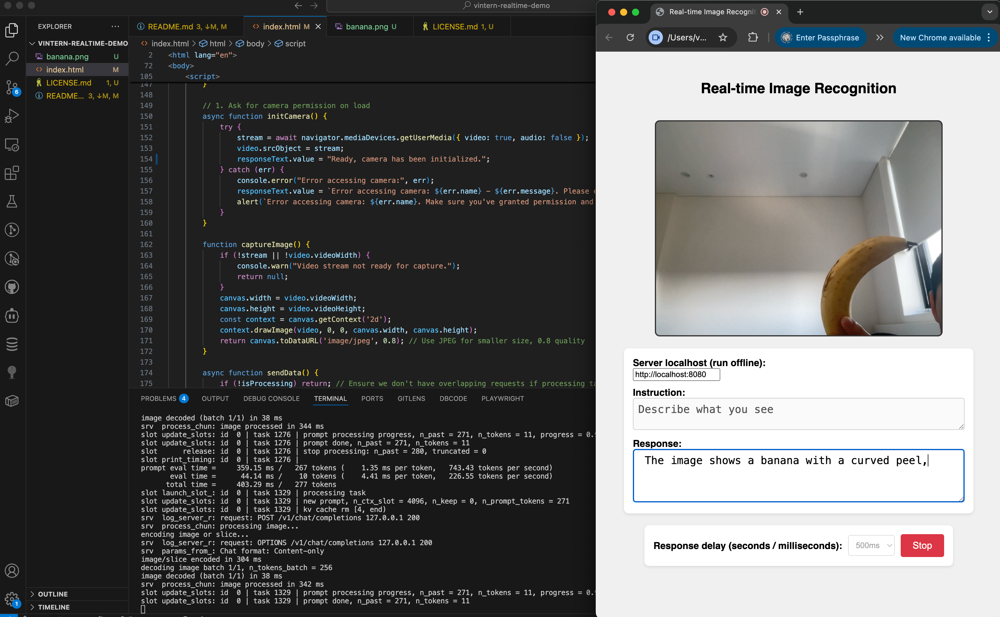
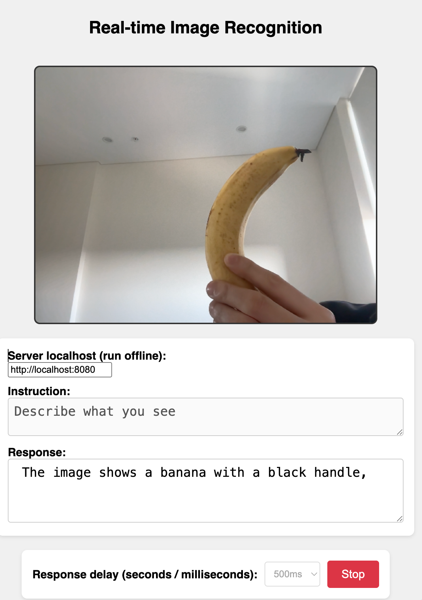

# Real-time Image Recognition - Vintern 1B Model

## Recommended Configuration

The Vintern model is very lightweight (1B), capable of running on personal computers **without requiring a GPU**. It's recommended to have a computer with at least 8 cores and 8GB RAM.

Reference to the original model here: https://huggingface.co/5CD-AI/Vintern-1B-v3_5

The server only needs internet to download the model for the first run. From the second time onwards, you can run it 100% **offline without internet**

## Setup Instructions

1. Install [llama.cpp](https://github.com/ggml-org/llama.cpp)
2. Run the command `llama-server -hf ngxson/Vintern-1B-v3_5-GGUF --chat-template vicuna`  
   Note: you may need to add `-ngl 99` to activate GPU (if you're using NVIDIA/AMD/Intel GPU)  
   Note (2): You can also try other models [here](https://github.com/ggml-org/llama.cpp/blob/master/docs/multimodal.md)
3. Open `index.html` (you don't need to run a local server, just open it in your browser)
   - If you have a local server running, you can use `http://localhost:8080` instead of `index.html` (not real-time)
   - If you have a different port, change the URL accordingly
4. (Optional) change the instructions, for example, tell it to return JSON instead of descriptions
5. Click on "Start"
6. Point your camera to any object, and the model will recognize it in real-time

## Demo 

### Using Vintern with llama

### Vintern with llama and browser

